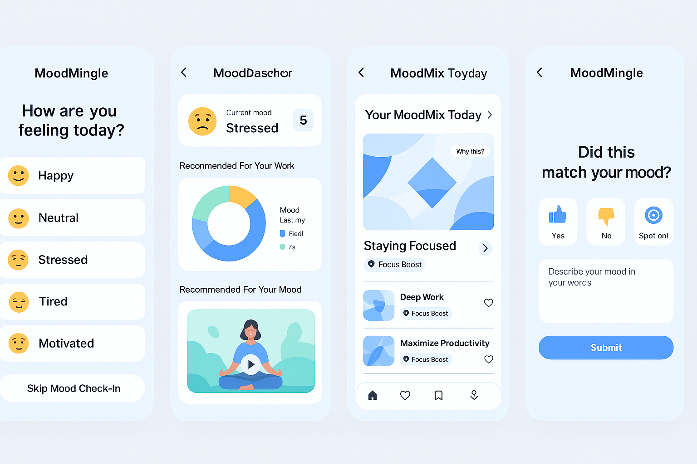

# Moodmingle
# 🎧 MoodMingle  
*Generative AI-Powered Mood-Based Audio Recommendations for Kuku FM*

MoodMingle is an AI feature prototype designed to personalize content on Kuku FM based on a user’s emotional state. By interpreting mood from user interactions, MoodMingle aims to increase daily listening time and app engagement through smarter recommendations.

---

## 💡 Why MoodMingle?

Traditional recommendation systems rely solely on past behavior. MoodMingle introduces emotional intelligence into the mix — giving users what they *feel like* listening to in that moment. It’s dynamic, empathetic, and user-first.

---

## 🧠 Core Concepts

- **Emotion-Aware Suggestions**: Uses NLP to identify a user’s mood from their queries and interactions.
- **Generative Personalization**: Combines mood clusters + collaborative filtering for content generation.
- **Adaptive Learning**: Continuously refines suggestions based on feedback and usage patterns.

---

## 📦 What's Inside

```
moodmingle/
├── README.md                     <- You are here!
├── prototype/
│   └── moodmingle_ui_mockup.png <- High-fidelity app UI screens
├── docs/
│   ├── MoodMingle_Report.pdf    <- Final project report for Kuku FM
│   └── architecture.png         <- System diagram
├── models/                      <- Sample model notebooks or sketches
│   └── mood_detection_model.ipynb
└── data/
    └── sample_user_logs.csv     <- (Optional) Example input data
```

---

## 🛠️ Built With

- **NLP**: Transformers (e.g., BERT/RoBERTa) for mood detection from queries
- **ML Clustering**: KMeans or DBSCAN for grouping emotional behavior
- **Collaborative Filtering**: Matrix factorization for personalization
- **Design**: Figma for UI prototyping

---

## 📱 UI Mockup




---

## 🚀 Getting Started

This repository is for proposal + prototype only. You can:
- Browse the [📄 report](docs/MoodMingle_Report.pdf)
- Explore the UI prototype in `/prototype`
- Check model ideas or add your own in `/models`

---

## 📈 Goals

- Make audio recommendations more *emotionally relevant*
- Improve daily session time and app stickiness
- Support user mood regulation through content

---

## 📬 Contact

Developed for the Kuku FM GenAI Assignment Round  
👤 Lahari Durga Challapalli

---

